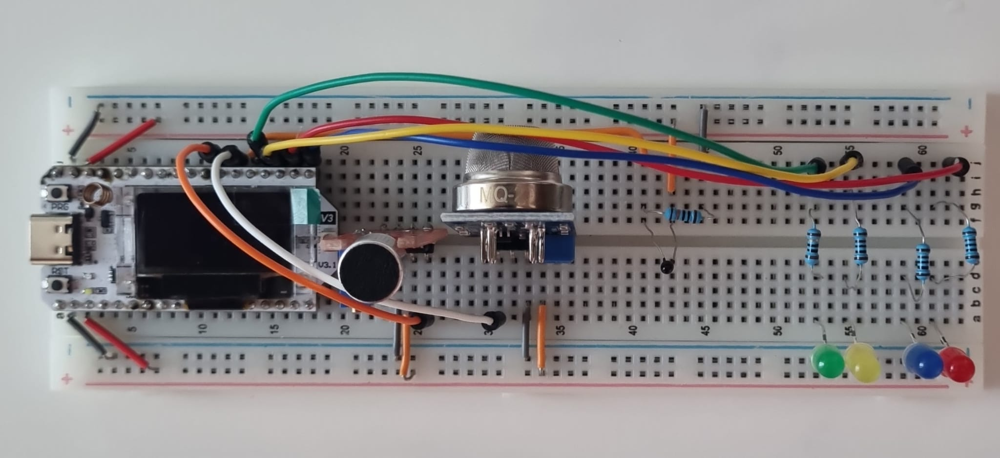
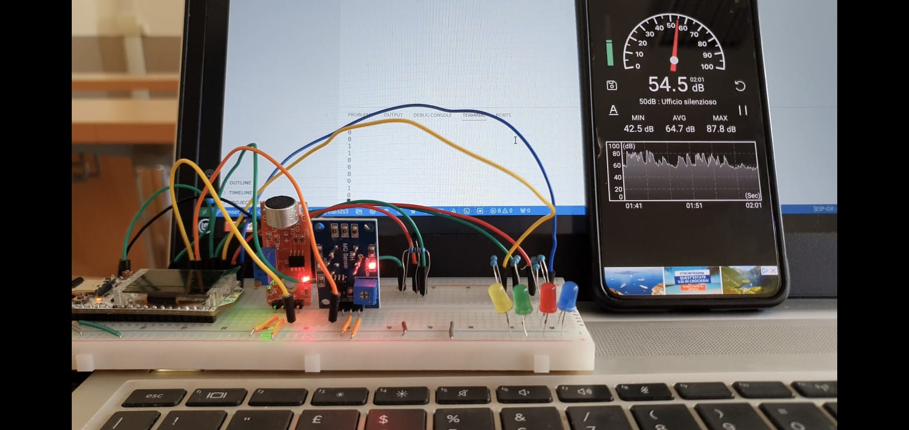
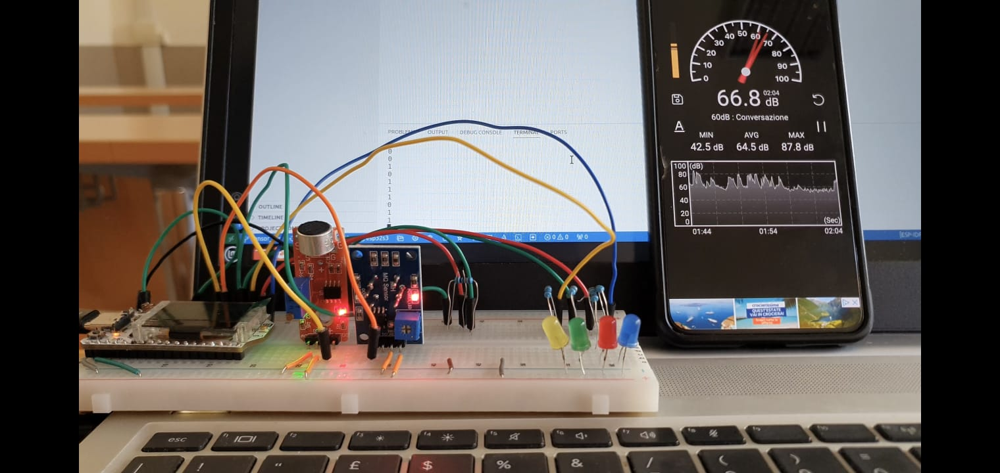
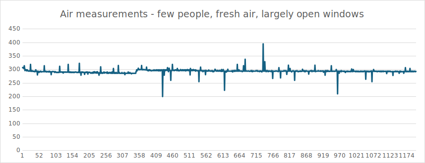
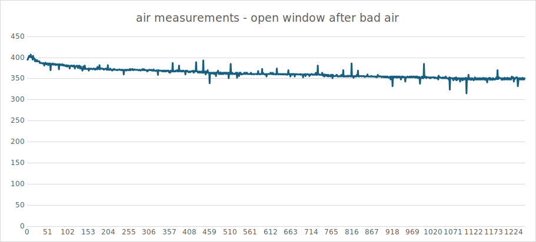
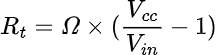
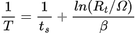
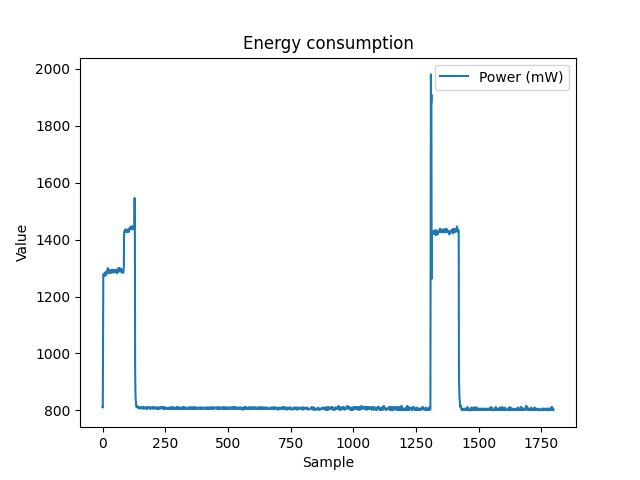
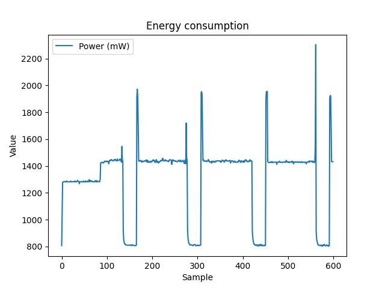

<h1>What's the mood - CENTRAL DEVICE</h1>
<i>Central device</i> is the master node of this IoT system. It's the bridge between the IoT network and the external broker. It manages the execution of the <i>helpers device</i>, giving them the instructions for starting the data sampling and the general result of all data sampled on the system. This result is evalueted computing the average of the data sampled by all the system devices. The average is shared to helper devices and a mqtt broker (<i>HiveMQ</i>).

<h2>Hardware configuration</h2>
Hardware element required for the central device implementation are:

- <b>ESP32S3</b>
- <b>breadboard</b>
- <b>MQ2 module</b>, the air module
- <b>AZDelivery KY-038 module</b>, the microphone
- <b>Thermistor</b>
- <b>4 leds</b>, one green, one yellow, one red and one blue
- <b>5 resistence</b>, one 10Ω, three 1kΩ and one 100kΩ
- <b>cables</b>, at least 17

The first step is to set the ESP on the top of breadboard and connect the 5V pin to the <i>left red line</i> of the breadboard, the left ESP ground to the <i>left blue line</i>, the 3.3V pin to <i>right red line</i> and the right ESP ground to the <i>right blue line</i>.

Set the microphone on the breadboard, connect its <i>positive pin</i> to the 5V line and <i>GND pin</i> one of ground lines. Connect <i>digital output (DO)</i> to the <i>GPIO1</i> of the ESP. Do the same for the air module, but for the sensor output use the <i>analog output (AO)</i> instead of the digital one. Connect this pin to the <i>GPIO2</i> of the ESP.

For the thermistor, set it on the breadboard and connect one of its leg to 3.3V line. On the orizzontal line of the other leg, insert the cable that connects the sensor to the ESP <i>GPIO3</i> pin and one of the leg 100kΩ resistence. The other part of the resistence is connected to a ground line.

Leds have the same configuration: the shortest led pin is connected to a ground line, the longest one is connected to a resistence that has also a connection to a <i>GPIO</i> pin of ESP. Each led has its resistence and its ESP pin, as shown in the following table.

<table>
    <tr>
        <th>LED</th>
        <th>RESISTENCE</th>
        <th>GPIO</th>
    </tr>
    <tr>
        <td>GREEN</td>
        <td>10Ω</td>
        <td>4</td>
    </tr>
    <tr>
        <td>YELLOW</td>
        <td>1kΩ</td>
        <td>5</td>
    </tr>
    <tr>
        <td>BLUE</td>
        <td>1kΩ</td>
        <td>6</td>
    </tr>
    <tr>
        <td>RED</td>
        <td>1kΩ</td>
        <td>7</td>
    </tr>
</table>

The hardware configuration could be as follow

<h3>Sensors: hardware analysis</h3>

Central has sensors and leds. It hasn't actuators because only the helpers intercat directly with the environment. Sensors used by central are:

- <b>a microphone</b>, with which the device checks if there is someone inside the classroom;
- <b>an air module</b>, the hardware used to get air data;
- <b>a thermistor</b>, a resistence that changes its value with room temperature.

More details of these sensors are on <code>README.md</code> of repository homepage.

Microphone value is taken on it's <i>digital output</i>, that will give an <i>high value</i>(1) if it detects a noise over a specific decibel value, otherwise it will give a <i>lower value</i> (0).

Air module has to give values on air quality, with an high range of values. For this reason, the output is taken on <i>analogic output</i> of the module.

Thermistor is a resistence with a value that changes with little temperature changement of the place where is located. To detect this changement, thermistor has one of its pin connect tho ESP pin.

The leds report a visual average of data sampled. They are four, two for air values and two for temperature:

- <b>green led</b> indicates a good qaulity of the air;
- <b>yellow led</b> indicates a bad quality of the air;
- <b>red led</b> indicates a high temeperature detected;
- <b>blue led </b> indicates a òpw temperature detected.

Led status will change each time data sampling is done.

<h2>Build and execution</h2>

To start central device, its code has to be <i>built</i>. Open a ESP-IDF terminal, that gives the possbility to execute the program <code>idf.py</code> (execution manager of the program loaded on an ESP device).

The first command to execute is <code>idf.py build</code>, which checks if there are errors on the written code and compiles the code. When the code is ready to be executed, it has to be loaded on the microcontroller with the command <code>idf.py flash</code>. In the end, for the program execution, the command to use is <code>idf.py monitor</code>.

The terminal used for program execution has to be opened on the directory of the program. In this case, the directory is <code>central/</code>.

To get a good execution of the whole project, the execution of each device follows an order: the first to be executed are the helper devices and then the central. If there are some problem with the execution, press the <i>RST</i> button on the ESPs, first the helper one and then the central one.

<h2>Software analysis</h2>

Central software starts with the initialization of part of the element required: wifi, esp-now and sensors. Mqtt unit will be initialized only when device has to trasmit the data to the broker. 

After initiliazations, central starts the communication with helper device with the goal of exchanging the MAC address: central communicates its address in broadcast, helper takes that MAC and it replies to the center on its address. After sending the message with the function <code>esp_now_tx()</code> (general function to trasmit the data with esp now), central device will wait the reply from the helper (<code>esp_now_rx()</code>, function that manages all the messages received with esp now). When helper MAC is correctly received by the central, the execution goes in an endless loop (the main part).

The first step of the loop is the people detection: <code>check_people()</code> is the function that returns <code>true</code> if it gets an high value from the microphone, otherwise it returns <code>false</code>. In this last case, central communicates to helper that nobody has been detected (it sends a message with payload "0"), it goes to sleep (<code>esp_light_sleep_start()</code>) and when the device wakes up it restarts the loop, checking the people in the room.

If a noise has been detected, central communicates to helper to start the data sampling (message with payload "1"), it waits that data from helper and then it samples its data with function <code>air_detection()</code>. When central has its data and helper's data, it proceeds with <code>elaboration()</code> that gives the data average. Average is communicated to the helper and to the mqtt broker. When these communications have been completed, central device goes to sleep.

<h3>Sensors: software analysis</h3>

Sensors can be of two type: <i>analogic</i> or <i>digital</i>. At software level, these output requires a different type of management, from initialization to the real use.

<h4>Analogic</h4>

In this project, the analogic sensors are the air module and the thermistor. Their initialization requeres:

- <code>esp_adc_cal_characterize()</code>, function that characterizes the attenuation of an ADC;
- <code>adc1_config_width()</code>, it configures the width of a ADC capture;
- <code>adc1_config_channel_atten()</code>, that sets the attenuation of particular channel.

An ADC value can be taken with <code>esp_adc_cal_raw_to_voltage()</code>, that gives millivolts value. This function is called on the code a specifc number of times (<code>SAMPLE</code>), with a specifc distance (<code>DELAY</code>, millisecond value). <code>SAMPLE*DELAY</code> it's the <b>sampling window</b> of the analogic sensors.

<h4>Digital</h4>

The digital sensor of the project is the microphone. Leds can be considered as digital component. The digital initialization is done with the function <code>gpio_set_direction()</code>, where specify if the element is an input element or an output one. Microphone is an input sensor, its value can be taken with the function <code>gpio_get_level()</code>(it follows the same <b>sampling window</b> of analogic sensors). Leds are output component, which value can be set with <code>gpio_set_level()</code>

<h3>ESP-NOW communication</h3>

Esp-now is a communication protocol that permits a message exchangement between the esp microcontroller. It works with the Wifi module, over a specific channel that has to be setted (<code>esp_wifi_set_channel()</code>). The main elements of this communication is the MAC address of the receiver, with which sender creates the peer to use with esp-now (<code>esp_now_add_peer()</code>).

The management of message trasmission and recption is given to <i>callback fucntion</i>. The function <code>sender_cb</code> gives the result of the trasmission, otherwise <code>receiver_cb</code> takes the message received and puts it on a queue (<code>xQueueSend()</code>), from which the device will take and analyze the message.  This function have be setted with <code>esp_now_register_recv_cb()</code> and <code>esp_now_register_send_cb()</code>.

The function that sends the message is <code>esp_now_tx()</code>, where the message is setted and trasmitted with <code>esp_now_send()</code>. When receiver has to analyse the message it calls <code>esp_now_rx()</code>, that takes the message with <code>xQueueReceive()</code> and start its analysis.

<h4>Packets</h4>

For exchanging informations, nodes provides an ad-hoc packet that is composed by two fields:
<ul>
    <li><code>type</code> : an integer identifying the type of packet to send/receive</li>
    <li><code>payload</code> : an array of chars identifying the specific content of packet</li>
</ul>

Since data can be send only as <code>uint8_t</code> variables, it is needed the usage of this structure for sending different types of informations while remaining under the limit dimension of 250B. There are different types of packets and they are summarizable as:

<table>
    <tr>
        <th>Name</th>
        <th>Value</th>
        <th>Description</th>
    </tr>
    <tr>
        <td>CENTRAL_MAC</td>
        <td>1</td>
        <td>Used for sending a packet containing the MAC address of the central device
        </td>
    </tr>
    <tr>
        <td>CENTRAL_WAKE</td>
        <td>2</td>
        <td>Notifies to the helper node if it has to start sampling data or go back to sleep, the payload contains "0" or "1" on the basis of what the microphone detected<td>
    </tr>    
    <tr>
        <td>CENTRAL_VALUE</td>
        <td>3</td>
        <td>Packet with this type contains a payload with informations about the average values of temperature and air quality after the receiving those coming from the helper<td>
    </tr>
    <tr>
        <td>HELPERL_MAC</td>
        <td>4</td>
        <td>Used for sending a packet containing the MAC address of the helper device; it follows the reception of the CENTRAL_MAC packet</td>
    </tr>
    <tr>
        <td>HELPERL_VALUE</td>
        <td>5</td>
        <td>Type for enlighting a packet with a payload representing the tuple of values with voltage detected from air sensor and the temperature obtained with thermistor; it is subsequent to CENTRAL_WAKE</td>
    </tr>
</table>

For types with values 3 and 5 the separator of the tuple containing air quality and temperature values is equal to the charcater "$".

<h3>Mqtt trasmission</h3>

The broker used for mqtt trasmission is <i>HiveMQ</i>. To communicate with it, the main element is the structure <code>esp_mqtt_client_config_t</code> that stores the values:

- <b>broker uri</b>, the endpoint to reach;
- <b>certificate</b>, generated from a termianal;
- <b>credentials</b> of a user that can access to the broker (username and password).

The message is sent to the broker with the function <code>esp_mqtt_client_publish()</code>.

Mqtt trnasmission is added to simulate a internet connection of this little network.

<h3>Threshold definition</h3>

The devices work several sensors, that give back data sampled. This data have to be analyzed, but not randomically. To get good quality of analysis, there are some tests to do that give the <b>threshold</b> if the data.

<h4>Microphone</h4>

The limit to find for the microphone the noise level: values above that level mean "lecture in progess", values below mean "no lecture in progress". Level value has to consider also the environment noises, then it has to be little bit high. The experiements taken have the goal to find this value, that requires the use of a specific code that print on terminal 1 if detect an important noise, 0 otherwise.

Noises detected when nobody is speaking inside the room, there is only the environment sounds.

Noises when someone is speaking inside the room.

As you can see from the images, the level value is more or less 60 decibel. This level is set on the "adjustable switching contact" of microphone with a screwdriver.

<h4>Air module</h4>

The air module gives in millivolts. As in the previousm experiment are done with specific code to find which is the level value that defines when air can be considered as "good quality" or "bad quality".

The environment of this picture is a big classroom with open windows. Data sampling starts with sensor turned on a side, then it's setted in right position (face up). When this changement occurs, a real value is sampled (more or less 300 mV). From that point, avoiding the peaks, there is a little improvement thanks to the open window.

This other envirinoment is a smallest room starting with a closed window at beginning that it's opened few moment later. It's more clear how opening a window can improve the quality of the air.

This two examples gives the good (300 mV) and the bad (400 mV) values of the air. Taking an average of the these two values, the level value of the air can be easily computed (more or less 350 mV).

<h4>Thermistor</h4>

Thermistor is a resistence that change its value with the environment temperature. This value is taken from a pin of the thermistor and brought in the esp as millivolts value. This last one has to be evaluted to give it a real sense (to give it the corrisponding temperature value). The formulas that make this operation are:

- <code>T</code> is the tempreature to get;
- <code>ts</code> is the nominal temperature;
- <code>Rt</code> is the thermistor resistence;
- <code>Ω</code> is the value of the external resistence;
- <code>β</code> is the thermistor sensivuty;
- <code>Vcc</code> is the input tension;
- <code>Vin</code> is the tension coming from thermistor;

<h3>Energy consumption</h3>

In this system, the devices are connected to multiple elements and they use the Wifi module, that requires a big quantity of energy. Therefore, find a way that permits to save energy in death moment is a crucial thing. This is the reason for which the devices, after the execution of multiple missions, enter in a <i>sleep mode</i> status. This <b>duty cycle</b> greatly reduces the enrgy consumption.

The following graphs has been created with a script python, it takes as input the energy detection of an Arduino module that analizes the consumption of ESP32S3 during the execution of central device.

 

As you can see, there are multiple level of energy consumption. The first (more or less at 1300 mW) has been detected when central device start to initializate its elements. The next higher point is reached when the device starts to make the data sampling. When data average is communicated to the broker, there is the first spike (communication to internet consumes a lot of energy). After the communication, device goes to sleep and consumptions goes to 800 mW, saving more less the 40% of energy. The highest point after sleep mode is required to wake up the systems, but it is isolated. Device after waking up goes back consume 1400 mW as in the previous sampling phase.

This second pictures shows how this pattern of energy consumption is reapeted during a long time execution, with multiple execution of the endless loop.
