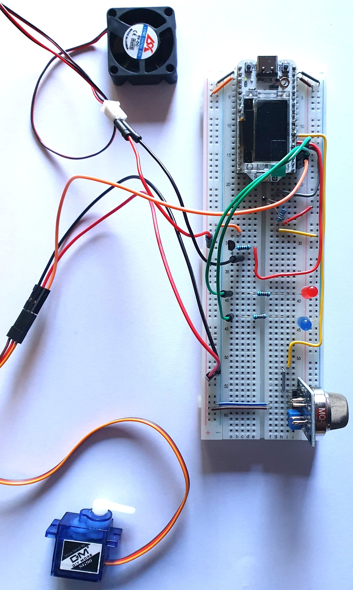
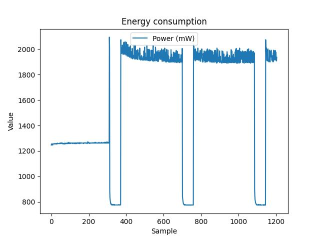
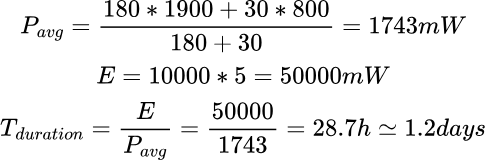
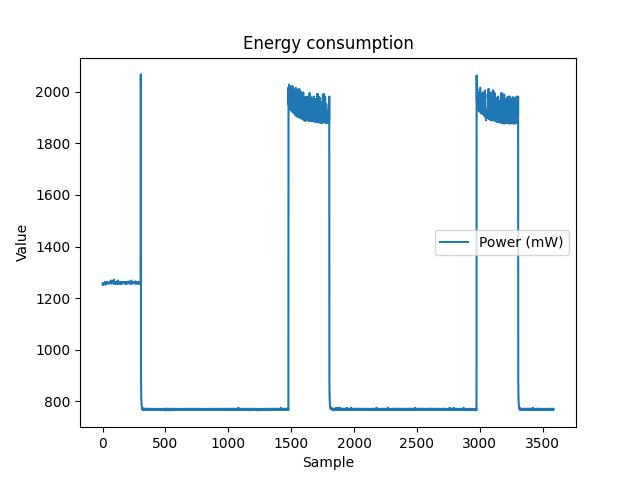
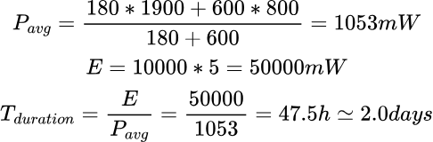

# Helper device #

The device has the aim to provide functionalities that concern about improvement of the quality of the room. Even if can be considered a variant of the central device, it interacts differently with the environment becuase of the actuators it is provided. It can be considered as the slave ndoe of the architecture of the project.

## Hardware ##
Other than a Espressif ESP32-S3 v3.1 and a breadboard, for the project is needed:

<table>
    <tr>
        <th>Component</th>
        <th>GPIO pin</th>
        <th>VCC</th>
        <th>Description</th>
    </tr>
    <tr>
        <td>MQ-2</td>
        <td>GPIO_NUM_1</td>
        <td>5V</td>
        <td>Sensor for detecting air quality</td>
    <tr>
    <tr>
        <td>S8050</td>
        <td>GPIO_NUM_2</td>
        <td>5V</td>
        <td>NPN transistor for managing fan usage</td>
    <tr>
    <tr>
        <td>Thermistor</td>
        <td>GPIO_NUM_3</td>
        <td>3.3V</td>
        <td>Restistor that changes its internal resistance wrt temperature</td>
    <tr>
        <tr>
        <td>Red LED</td>
        <td>GPIO_NUM_4</td>
        <td>3.3V</td>
        <td>Simple red LED for alerting about what fan is being used for</td>
    <tr>
    <tr>
        <td>Blue LED</td>
        <td>GPIO_NUM_5</td>
        <td>3.3V</td>
        <td>Simple blue LED for alerting about what fan is being used for</td>
    <tr>
    <tr>
        <td>Servomotor</td>
        <td>GPIO_NUM_6</td>
        <td>5V</td>
        <td>Actuators for managing the opening of the window</td>
    </tr>
        <td>Cooling fan</td>
        <td>None</td>
        <td>5V</td>
        <td>Fan used to simulate a conditioner for heating or cooling the room</td>
    <tr>
</table>

For each component is reported the pin to connect with, input tension and a short description about its utility.

### Hardware configuration ###

#### MQ-2 ####
This is the air-quality detection sensor used for monitoring how stale the air is inside the room. For this component it is adopted a sampling of the analog output provided as output in different situations for estabilishing a which level is needed to interact with the environment. Even if it provides also a digital output, it is preferred to use the analog one for threshold compatibilities.

#### NPN S8050 transistor and cooling fan ####
NPN transistor that is capable to amplify and/or commute signals for small devices like these that are used for the project. Using the signal coming from the GPIO pin, it can be used to manage the functioning of the cooling fan managed by the ESP32. So, collector is collector is linked to the negative connector of the fan, the base to the GPIO of the mcu and emitter to ground.

The fan is controlled through the previously described component and its capable to (virtually!) decrease or increase the temperature. Differently from some others fans, it has no possibility to change the speed of the fan due to lack of third pin.

#### NTC Thermistor ####
Component that belongs to family of semiconductors that changes its internal resistance with different values of temperature. For this project, it covers a relevant role because of it allows to detecte if is needed to activate the conditioner for restoring the temperature of the room to acceptable level. Also for this sensor, it is used an analog signal for getting data.

#### Servomotor ####
Actuator capable to interact with something movable that can improve the quality of the air. Its functioning is based on the usage of PWM signals generated through the ESP32 by modifing a value that represent the position and changing the period of the signal itself.

## Software ##
The required main and relevant software for making the project working are:
<table>
    <tr>
        <th>Software</th>
        <th>Description</th>
    </tr>
    <tr>
        <td>
            FreeRTOS
        </td>
        <td>
            Open source real time operating system suitable for microcontrollers and embedded systems; it provides multitasking, interrupts, synchronization, memory management and instructions scheduling.
        </td>
    </tr>
    <tr>
        <td>
            ESP-IDF
        </td>
        <td>
            Official Espressif development framework for ESP32 microcontrollers; it relies on FreeRTOS, allowing all its benefits and functionalities.
        </td>
    </tr>
    <tr>
        <td>
            ESP-NOW
        </td>
        <td>
            Wireless protocol communication for Espressif devices; it provides E2E communication with low latency, high energetic efficiency and high scalability just using the WiFi module included into the microcontroller.
        </td>
    </tr>
</table>

### Data sampling ###
By using the Analaog-to-Digital converter and the General Purpose Input-Output pins (GPIOs), it is possible to sample date from sensor and sending signals for handling actuators. In particular, after initializing the relative <code>esp_adc_cal_characteristics_t</code> structure for a certain pin using the library functions, it is needed to set the channel for detecting signals: for each of the sensor is related a channel for avoiding interferences or other issues. Once this configuration, for analog signals is needed the funcion <code>esp_adc_cal_raw_to_voltage()</code> that takes as input the raw signal from the configured ADC unit and a pointer to the structure previously initializated to it.

### Building and exectuing the code ###
In order to get the software working properly, is needed to run the commands <code>idf.py build</code>, <code>idf.py flash</code> and <code>idf.py monitor</code>. If needed, it may be require to execute a clean of the previous build by <code>idf.py fullclean</code> .

### Running the project ###
The execution of the code used fot the project can be divided into some different phases starting from an initial "handshake" to the exchange of individually sampled information and the relative interaction to the environment. For completeness, they are shortly reported.

#### MAC exchange #### 
It uses the callbacks <code>send_cb</code> and <code>recv_cb</code> and the function <code>send_mac</code> for exchanging its own MAC address with central node, consume the message by the usage of <code>conusme_message</code> that detects the type of the packed received/send; once get the mac, it will be set by the function <code>set_peer</code> with argument the variable containing central MAC.

#### Sampling phase #### 
Once received the approvation for sampling datas, the dedicated function <code>get_values</code> starts to collect information from the environment: 10 samplings for temperature and other 10 for air in orrder to get an arithmetical mean of each of them. After their computation, data will be send to central and the device will wait for other information by other peer.

#### Reception of averaged data and interaction with environment #### 
After receiving information from central with an average of collected data from each of them, this device will elaborate them and decides what to do. Elaboration of data consists of a parsing of the payload that is inside the packet sent back by central device. After that operation, if temperature and quality of air are above or below a certain threshold, helper will act using the fan and the servomotor to improve the quality of the room.

#### Sleep mode time ####
For reducing energy consumption of the this node, the system is developed for using a light sleep mode: it consists of a low-consume condition for the processor that cuts off a lot of power to components, reducing availability of functionalities while maintaing a restricted set of information in memory. After receiving a packet with no need to compute the sampling phase or terminated the actions to do with actuators, the mcu will go to sleep for 10 minutes.

## Energy consumption ##
The analysis about the energy consumption of the device with all the sensor connected with, shows some interesting details. Setting a too short period of sleep leads to a very high consumption of resources. 

For the following graphs is needed to underline the fact that power values has mW as unit while each sampling is done each half second, so, each element of horizontal axis is to consider as 0.5s and not 1.0s .

### High sleep/awake ratio ###
The importance of chosing a good trade-off between between period of sleep and period of activity is fundamental for obtaining a reasonable energy consumption. Applying a sleep of only 30s, with respect of an average up time of 180s, leads to this situation:

 

As can be observed by the plot, even if the light sleep reduces the energy consumption for a factor approximatively equal to 2.5, the average, there are an quite high spike of energy needed for functioning. As the practice allows to observe, the device will be for more or less 3 minutes in activity and am average of half a minute in a sleepy state. It is interesting to observe that it is required an average of 1900 mW of power for maintaining in activity the device while is executing the code abaout interaction and communication and an average of 800 mW for the sleep mode phase. Knowing that the mcu is powered via USB, the nominal tension used by it is about 5V. Assuming to use a battery of 10000 mAh, it is possible to achieve the time that this battery can be up:
 

### Low sleep/awake ratio ###
Instead of a short period of sleep of 30s, it can be quite better to use a longer interval of 600s (10 min) that allows to obtain something like that:

 

The reduction of the power needed between awake and sleep states is the same, alway arounf 2.5 times better for the second one. By applying the longer sleep time, it can be reached an higher lifetime of the battery:
 

### Observations ###
As can be appreciated by the graphs and the numerical results, appying a longer sleep period time benefits the efficiency of the battery duration. However, this value can be also enough unsufficient due to different possible applications of the project. 

An important observation relies on the fact that the sammpled energy consumption is related to a "bad" case on the overall usage of the system. In fact, it was provided a situation where the devices had to communicate the presence of people inside the room, a bad quality of the air and an high temperature. With all those factors, the ESP32 is in a condition where it has to send a signal to the servomotor for opening the window and it also has to activate the fan. Another relevant detail to underline is that the actuators can be power supplied by an external source of power like the 220V AC.

Finally, the thermistor does not require a lot of power unlike the air sensor that has to heat an internal coil and maintains it at a quite high temperature for detecting the gasses inside the air.
